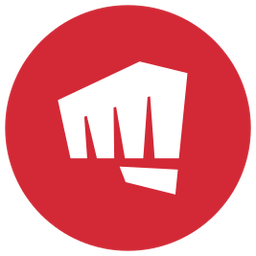
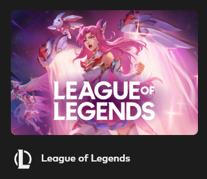

<h1 align="center">Riot Client | Tela de login de League Of Legends.</h1>

  <a href="#-tecnologias">Tecnologias</a>&nbsp;&nbsp;&nbsp;|&nbsp;&nbsp;&nbsp;
  <a href="#-projeto">Projeto</a>&nbsp;&nbsp;&nbsp;|&nbsp;&nbsp;&nbsp;
  <a href="#memo-licença">Licença</a>

 
  
  

    

  

 

  

# 📄 Descrição:

### O que foi desenvolvido?

- Um clone da tela inicial de login do jogo da Desenvolvedora Riot Games, chamado League of Legends.

# 🚀 Tecnologias:

Esse projeto foi desenvolvido com as seguintes tecnologias:

### HTML5

### CSS3

### JavaScript

# 🚧 Projeto:

### [Confira aqui!](https://riotclient.vercel.app/)

# 🎨 Inspiração:

### [League of Legends Login Page](https://www.leagueoflegends.com/pt-br/)

# 📝 Licença:

Esse projeto está sob a licença MIT. Veja o arquivo LICENSE para mais detalhes.

Made by <a href="https://wwwjhonatan.oliveira.com/" target="_blank">Jhonatan Oliveira</a>.
